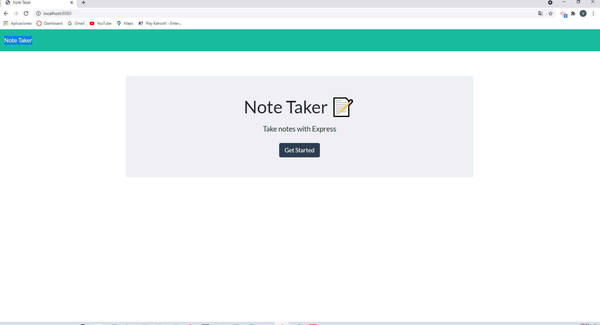
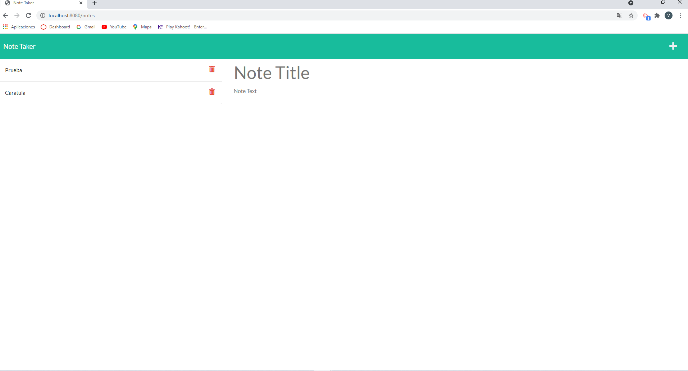
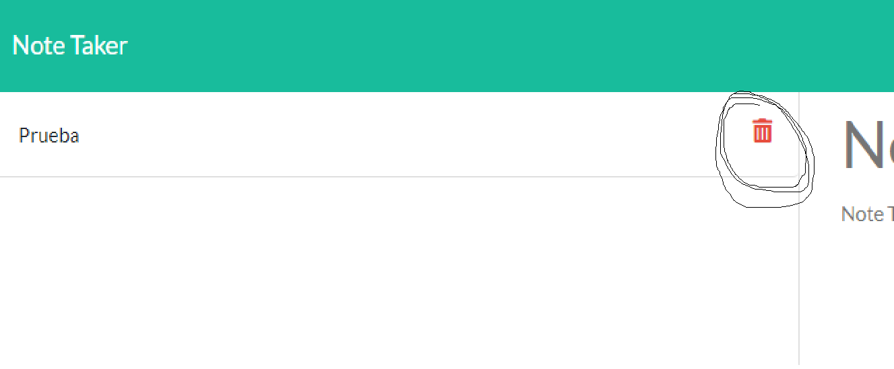

# Note Taker 

Is an application that has a Landing page that then takes you to a page where yo can capture new notes and stored.

Then stored Notes are shown in the left portion of the screen as a list.

Each stored notes has a delet botton that when it is activated note is deleted and a new list with stored notes is shown.

# Technology Used

* Node.js
* JavaScript
* Express

